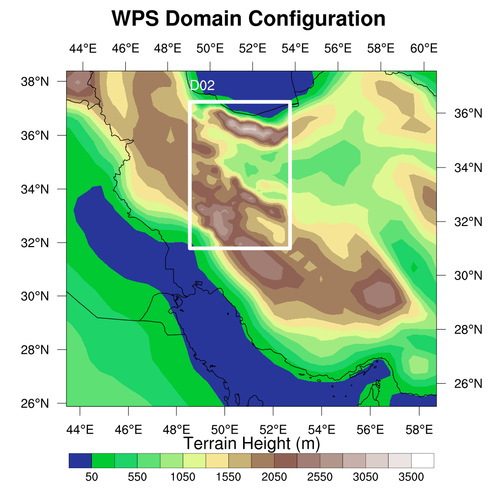

=====================================
Modify the area inside a bounding box
=====================================

WRFtailor can modify the WRF input data (grid points) inside a bounding box specified by latitudes and longitudes. by providing the desired variable to be modified and a polynomial to replace the values of the desired variable.

All required settings can be managed by a text file (**namelist.wrf**).

Example
=======

**Modify WPS geographical data (geo_em.d01.nc and geo_em.d02.nc):**

Provide the paths to the files in *namelist.tailor*:

.. role:: raw-html(raw)
    :format: html

| \====================== WRF files and input data ======================= :raw-html:` ` 
| \=================================================================== :raw-html:` ` 
| number_of_domains              = 2
| domain_1                       = /home/anikfal/extra_codes/SR/emissions/wrfchemi/geo_em.d01.nc
| domain_2                       = /home/anikfal/extra_codes/SR/emissions/wrfchemi/geo_em.d02.nc
| domain_3                       =
| domain_4                       =
| domain_5                       =
| -------------------------------------------------------------------------------------------------

Set *namelist.tailor* to modify the values of the desired variables:

| \====================== Modify by bounding box ========================= :raw-html:` ` 
| \=================================================================== :raw-html:` ` 
| bounding_box_ON_OFF             = 1
|  target_variable2               = ALBEDO12M
|  target_var_level2              = 1
|  substitute_variable2           = ALBEDO12M * 3
|  substitute_var_levels2         = 1,
|  north_lat                      = 35
|  south_lat                      = 34
|  west_long                      = 48
|  east_long                      = 51.5
| -------------------------------------------------------------------------------------------------

In the table above, the variable *ALBEDO12M* in the area inside a bounding box specified by *north_lat*, *south_lat*, *west_long*, and *east_long*, will be modified and replaced by *ALBEDO12M * 3*.
*substitute_var_levels2* specifies the levels for *ALBEDO12M*, which is the month of the year.

Parent domain and nested domains for the WRF input data (geo_em):

   
   WRF domain structure

Nested domain will be tailored as shown below:

.. figure:: images/bounding2.png
   :scale: 50 %
   :alt: Tailored nested domain
   
   Variable *ALBEDO12M*, modified by WRFtailor

Parent domain will be tailored as shown below:

   
   Variable *ALBEDO12M*, modified by WRFtailor