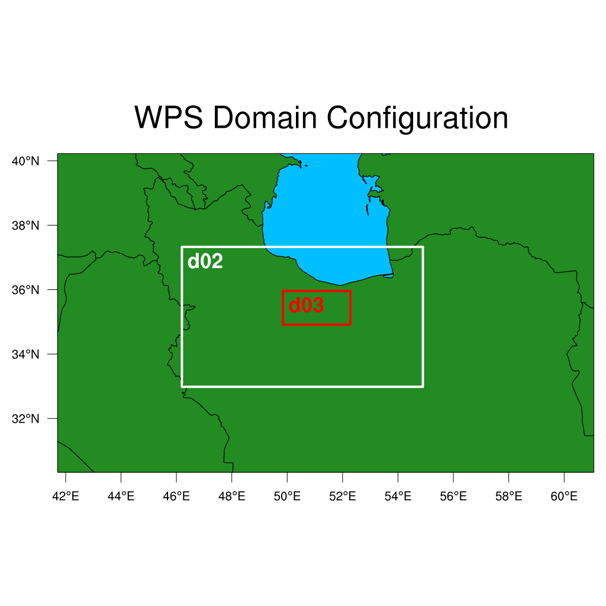
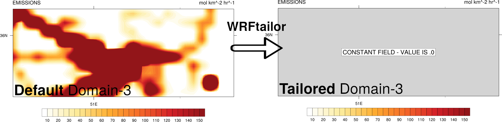
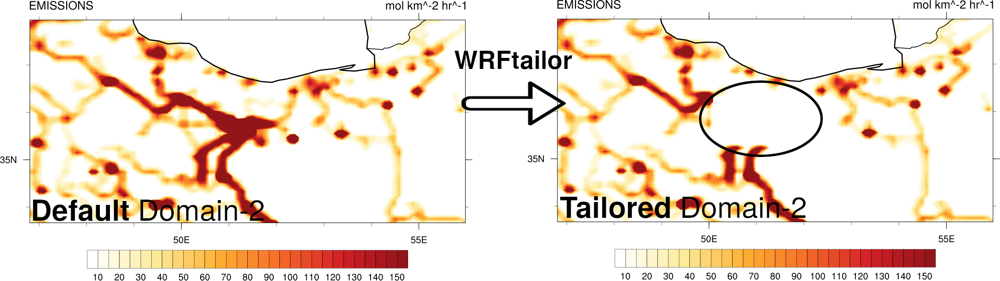
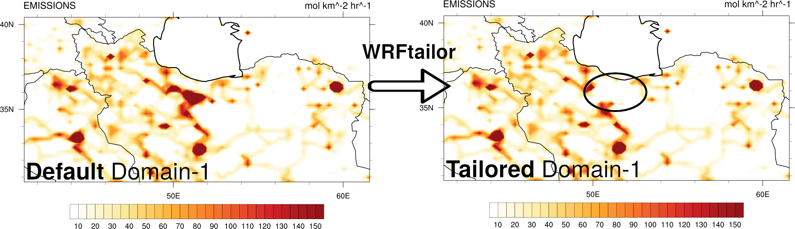

================================================
Modify WRF input data by the whole nested domain
================================================

WRFtailor can modify the WRF input data (grid points) over the whole nested domain. The nested domain is always the smallest one. For example, if there are one parent domain, one subdomain, and one sub-subdomain, the 3rd domain will be selected.

All required settings can be managed by a text file (**namelist.wrf**).

Example
=======

**Modify WRF/Chem emissions data (wrfchemi_d01_2021-01-22_00:00:00, wrfchemi_d02_2021-01-22_00:00:00, and wrfchemi_d03_2021-01-22_00:00:00):**

Provide the paths to the files in *namelist.tailor*:

.. role:: raw-html(raw)
    :format: html

| \====================== WRF files and input data ======================= :raw-html:` ` 
| \=================================================================== :raw-html:` ` 
| number_of_domains              = 3
| domain_1                       = /home/anikfal/aatrain/wrftailor/wrfchemi_d01_2021-01-22_00:00:00
| domain_2                       = /home/anikfal/aatrain/wrftailor/wrfchemi_d02_2021-01-22_00:00:00
| domain_3                       = /home/anikfal/aatrain/wrftailor/wrfchemi_d03_2021-01-22_00:00:00
| domain_4                       =
| domain_5                       =
| -------------------------------------------------------------------------------------------------

Set *namelist.tailor* to modify the values of the desired variables:

| \=================== Modify by the whole nested domain ================= :raw-html:` ` 
| \=================================================================== :raw-html:` ` 
| whole_domain_ON_OFF             = 0
|  target_variable4               = E_CO
|  target_var_level4              = 1
|  substitute_variable4           = E_NO * 0
|  substitute_var_levels4         = 1,
| -------------------------------------------------------------------------------------------------

In the table above, the variable *E_CO* over the smallest nested domain, will be modified and replaced by *E_NO * 0*, which turns the values to zero.

Parent domain and nested domains for the WRF input data (geo_em):

   
   WRF domain structure

Nested domain will be tailored as shown below:

   
   Variable *E_CO*, modified by WRFtailor

Nested domain will be tailored as shown below:

   
   Variable *E_CO*, modified by WRFtailor

Parent domain will be tailored as shown below:

   
   Variable *E_CO*, modified by WRFtailor