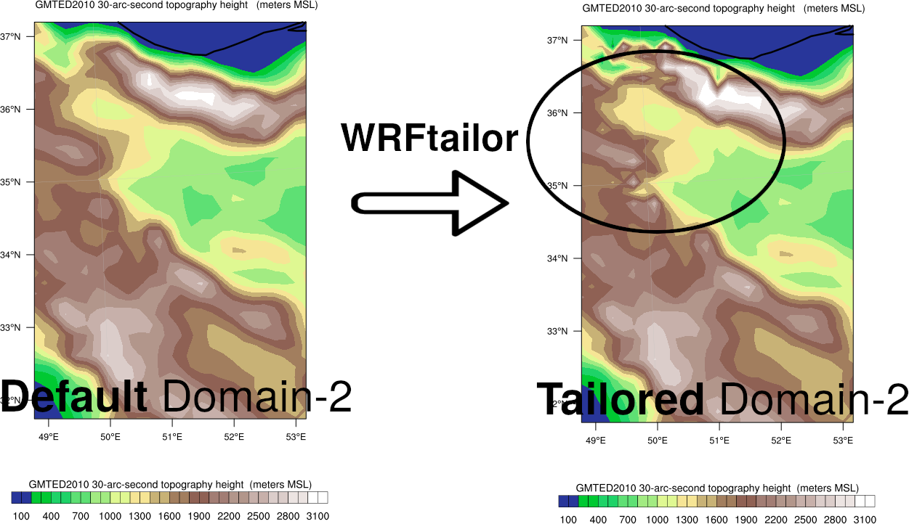
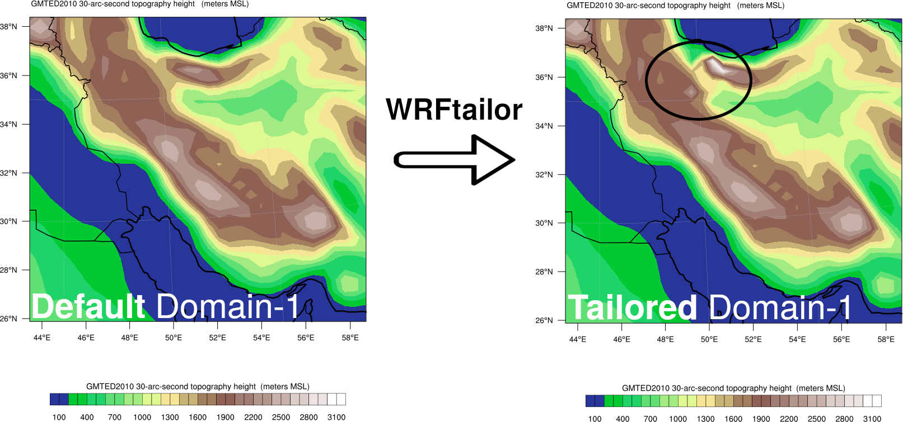

=================================
Fill an area using a geotiff file
=================================

WRFtailor can modify the WRF input data (grid points) by replacing its values by a GeoTiff file.

All required settings can be managed by a text file (**namelist.wrf**).

Example
=======

**Modify WPS geographical data (geo_em.d01.nc and geo_em.d02.nc) and replace the values using a GeoTiff file:**

Provide the paths to the files in *namelist.tailor*:

.. role:: raw-html(raw)
    :format: html

| \====================== WRF files and input data ======================= :raw-html:` ` 
| \=================================================================== :raw-html:` ` 
| number_of_domains              = 2
| domain_1                       = /home/anikfal/extra_codes/SR/emissions/wrfchemi/geo_em.d01.nc
| domain_2                       = /home/anikfal/extra_codes/SR/emissions/wrfchemi/geo_em.d02.nc
| domain_3                       =
| domain_4                       =
| domain_5                       =
| -------------------------------------------------------------------------------------------------

Set *namelist.tailor* to modify the values of the desired variables:

| \==================== Replacement by GeoTIFF data ======================= :raw-html:` ` 
| \=================================================================== :raw-html:` ` 
| geotiff_replace_ON_OFF           = 0
|  target_variable5                = HGT_M
|  target_var_level5               = 1
|  geotiff_file                    = /home/anikfal/aatrain/wrftailor/dem_tehran.tif
| -------------------------------------------------------------------------------------------------

In the table above, the variable *HGT_M* will be replaced by the values of *dem_tehran.tif*. The values outside of *dem_tehran.tif* boundary will not be changed.

Parent domain and nested domains for the WRF input data (geo_em):

.. figure:: images/dom222.png
   :scale: 50 %
   :alt: map to buried treasure
   
   WRF domain structure

Nested domain will be tailored as shown below:

   
   Variable *HGT_M*, modified by WRFtailor

Parent domain will be tailored as shown below:

   
   Variable *HGT_M*, modified by WRFtailor