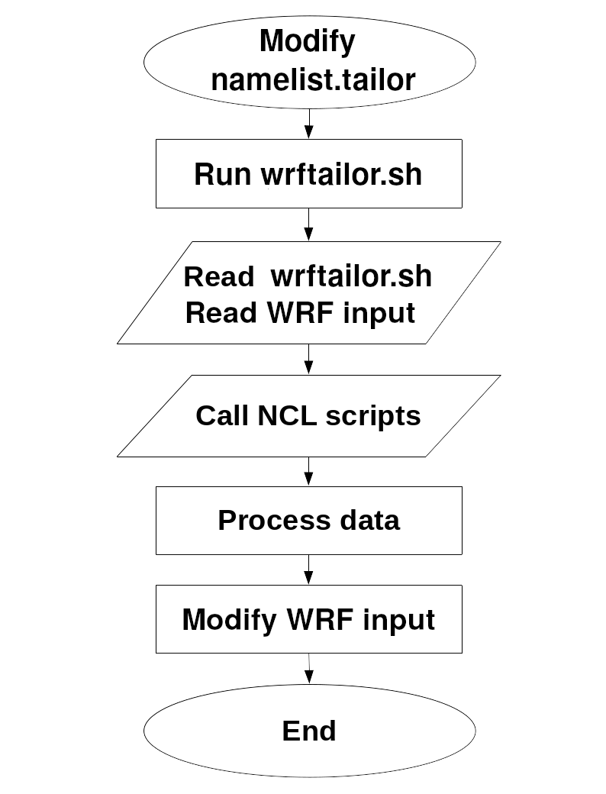

========
Overview
========
WRFtailor provides 5 different approaches to tailor and modify WRF input data. All processing inside WRFtailor are carried out by Shell script and NCL codes.

WRFtailor's structure is very similar to `PostWRF Software tool <https://github.com/anikfal/postwrf>`_.

Software structure
==================

The processing steps through WRftailor is depicted below as a flowchart diagram:

   
   WRFtailor structure and run processes

Run WRFtailor
=============

Modify namelist.tailor and enable the section associated with the desired tailoring approach (modify by shapefile, by bounding box, etc.):

.. code-block:: bash

    vi namelist.tailor

Run the tool:

.. code-block:: bash

    ./wrftailor.sh

.. The user can Run postwrf.sh with some special switches. Each switch is described by the command bellow:

.. .. code-block:: bash

..     ./postwrf.sh -h
