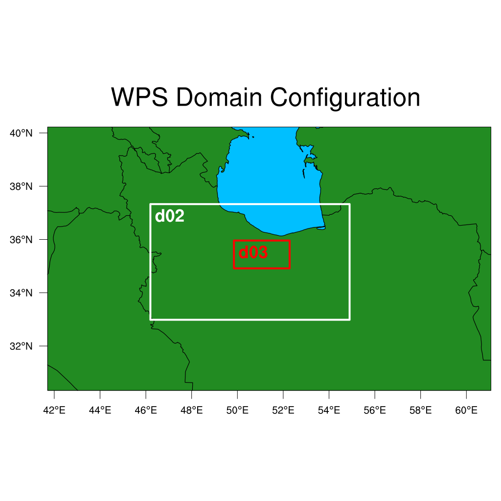

===========================================
Modify WRF input data over a list of points
===========================================

WRFtailor can modify the WRF input data (grid points) over a list of points specified by pairs of latitudes and longitudes, by providing the exact new values for each point to replace the default value.

All required settings can be managed by a text file (**namelist.wrf**).

Example
=======

**Modify WRF/Chem emissions data (wrfchemi_d01_2021-01-22_00:00:00, wrfchemi_d02_2021-01-22_00:00:00, and wrfchemi_d03_2021-01-22_00:00:00):**

Provide the paths to the files in *namelist.tailor*:

.. role:: raw-html(raw)
    :format: html

| \====================== WRF files and input data ======================= :raw-html:` ` 
| \=================================================================== :raw-html:` ` 
| number_of_domains              = 3
| domain_1                       = /home/anikfal/aatrain/wrftailor/wrfchemi_d01_2021-01-22_00:00:00
| domain_2                       = /home/anikfal/aatrain/wrftailor/wrfchemi_d02_2021-01-22_00:00:00
| domain_3                       = /home/anikfal/aatrain/wrftailor/wrfchemi_d03_2021-01-22_00:00:00
| domain_4                       =
| domain_5                       =
| -------------------------------------------------------------------------------------------------

Set *namelist.tailor* to modify the values of the desired variables:

| \====================== Modify by list of points ====================== :raw-html:` ` 
| \=================================================================== :raw-html:` ` 
| points_list_ON_OFF              = 1
|  target_variable3               = E_NO
|  target_var_level3              = 1
|  latitudes_list                 = 33.6, 37.5, 36.94, 37.2, 32.8, 34.2
|  longitudes_list                = 49.55, 50.11, 53.22, 54.33, 54.8, 50.9
|  point_values                   = 2000, 2000, 2000, 2000, 2000, 2000
| -------------------------------------------------------------------------------------------------

In the table above, the variable *E_NO* over a list of points specified by pairs of latitudes and longitudes, will be modified and replaced by *point_values*.

Parent domain and nested domains for the WRF input data (geo_em):

   
   WRF domain structure

Nested domain will be tailored as shown below:

   
   Variable *ALBEDO12M*, modified by WRFtailor

Nested domain will be tailored as shown below:

   
   Variable *ALBEDO12M*, modified by WRFtailor

Parent domain will be tailored as shown below:

   
   Variable *ALBEDO12M*, modified by WRFtailor