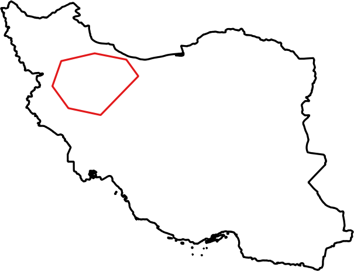
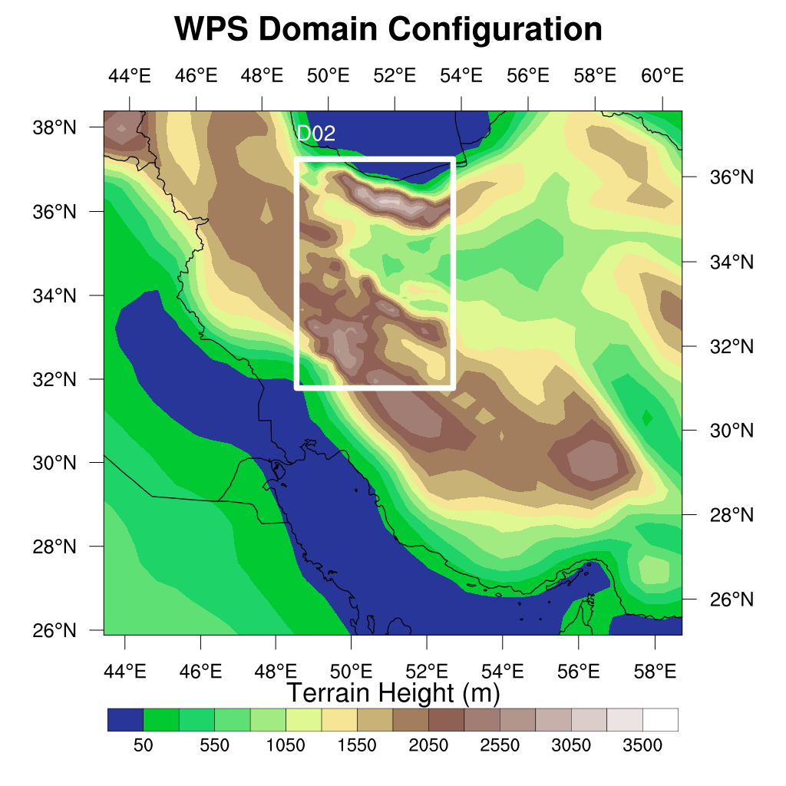
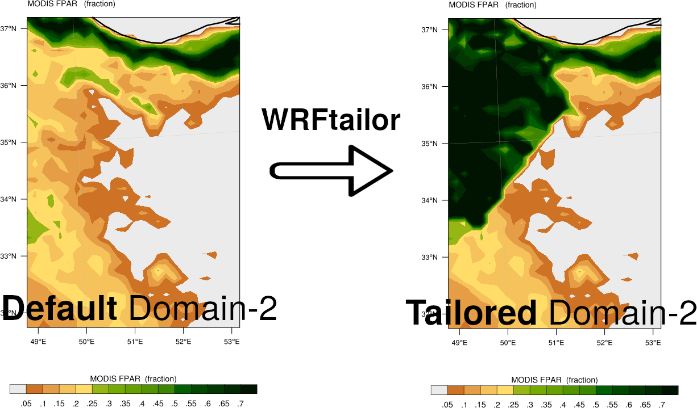
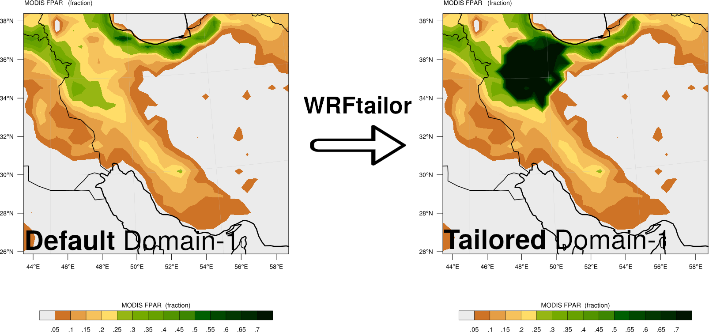

========================================
Modify the area specified by a shapefile
========================================

WRFtailor can modify the WRF input data (grid points) inside the area of a shapefile, by providing the desired variable to be modified and a polynomial to replace the values of the desired variable.

All required settings can be managed by a text file (**namelist.wrf**).

.. note::
   The shapefile can partly cover the domains. For example, it is okay if the shapefile be entirely inside the parent domain, but covers half of the subdomain.

Example
=======

**Modify WPS geographical data (geo_em.d01.nc and geo_em.d02.nc):**

Provide the paths to the files in *namelist.tailor*:

.. role:: raw-html(raw)
    :format: html

| \====================== WRF files and input data ======================= :raw-html:` ` 
| \=================================================================== :raw-html:` ` 
| number_of_domains              = 2
| domain_1                       = /home/anikfal/extra_codes/SR/emissions/wrfchemi/geo_em.d01.nc
| domain_2                       = /home/anikfal/extra_codes/SR/emissions/wrfchemi/geo_em.d02.nc
| domain_3                       =
| domain_4                       =
| domain_5                       =
| -------------------------------------------------------------------------------------------------

Set *namelist.tailor* to modify the values of the desired variables:

| \====================== Modify by shapefile mask ======================= :raw-html:` ` 
| \=================================================================== :raw-html:` ` 
| shapefile_ON_OFF                = 1
|  target_variable1               = LANDUSEF
|  target_var_level1              = 12
|  substitute_variable1           = (ALBEDO12M * 1.1) + EROD + GREENFRAC + 1.2
|  substitute_var_levels1         = 1,1,6
|  path_to_shapefile              = /home/anikfal/extra_codes/tehranbasin.shp
|  inverse_mask_on_off            = 0
| -------------------------------------------------------------------------------------------------

In the table above, the variable *LANDUSEF* in the area inside the shapefile *tehranbasin.shp* will be modified and replaced by *(ALBEDO12M * 1.1) + EROD + GREENFRAC + 1.2*.
*substitute_var_levels1* specifies the levels for *ALBEDO12M*, *EROD*, and *GREENFRAC*, respectively. Levels for each of these variable may be a special dimension (month, soil layer, etc).

Shapefile area to be used for modifying the *LANDUSEF* variable:

   
   Shapefile border

Parent domain and nested domains for the WRF input data (geo_em):

   
   WRF domain structure

Nested domain will be tailored as shown below:

   
   Variable *LANDUSEF*, modified by WRFtailor

Parent domain will be tailored as shown below:

   
   Variable *LANDUSEF*, modified by WRFtailor